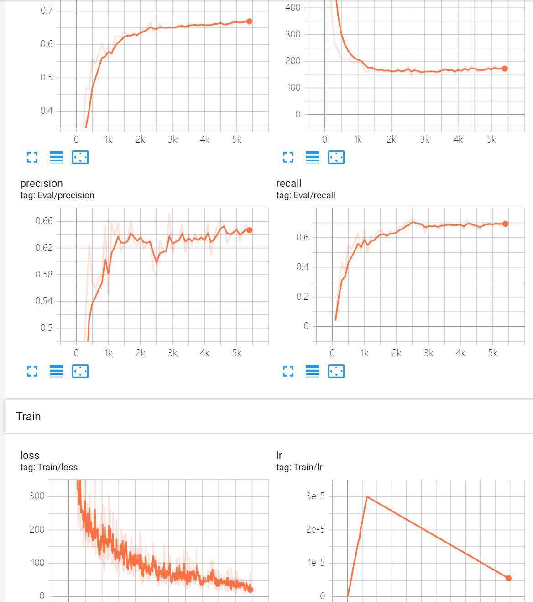

# LIC_2020

For Language and Intelligence Chanllenge task 5: [Event Extraction](https://aistudio.baidu.com/aistudio/competition/detail/32?isFromCcf=true&lang=en)

## Pipeline

1. Create your branch and develop in it.  
2. Discussion and code review before merge.

## Discussion & Reference

Discussion: [issue2](https://github.com/ZacBi/LIC_2020/issues/2)
Reference: [issue3](https://github.com/ZacBi/LIC_2020/issues/3)

## FYI

1. Think about using **continous integration** while developing(github->action)  
2. Consider python package (wheel or .egg) for using some common utils(F-measure or others), For more info: [link](www.pythonwheels.com/)  
3. Use [Click](https://click.palletsprojects.com/en/7.x/) instead of python build-in Argparse for command develop.

------

## Pipeline in Paddle env

```sh
# Clone repo
git clone -b ner_crf https://github.com/ZacBi/LIC_2020.git
cd ./LIC_2020

# Conda env
sh env.sh
source activate torch
conda install --yes --file requirements.txt

# Install package
pip install -e ./ --no-binary :all:
```

------

## Experiment

### 04/28

&emsp;&emsp;终于抽空出来把数据集分析写一下了, 惭愧现在才能全部投入比赛, test2过两个星期都要放出来了...  
&emsp;&emsp;用NER的`chunk eval`和CRF的NLL训练了一下模型, 模型是RoBERTa-wwm-ext-large, 也尝试使用了BERT-wwm, 但是差别并不明显. 发现`f1`在验证集上稳定在0.66左右, 注意这里的分数和PaddlePaddle的baseline的测评标准不一样, 这里更严格一些, 虽然也粗糙一些. `loss`比较大有点想不明白, 可能是训练集数据集分布差别有点大了, 毕竟train的`loss`到后面其实也不到20.  
&emsp;&emsp;PLMEE里面有提到`argument overlap`的问题, 即一个`argument`可能在一个事件中充当多个`role`的现象, DuEE的数据集里面是一个句子对应多个事件.
这里`argument overlap`的概念就被扩展了.
`argument`不仅要竞争同一个事件的`role`,
还要在多个事件中竞争`role`, 问题可能出在这里. 我把训练集中的数据分布研究了一下, 页面篇幅所限, 这里只摘取了部分结果.可以看到主要问题几个:

1. 各个类样本不平衡问题, 事件类型其实也是有较大差别的.
2. 多事件的多标签问题, 这个占了大概10%, 还是需要解决.
3. `argument overlap`问题, 这个比较严重, 占比也在10%左右.
4. 此外下面没有列出有些事件中还存在空论元的情况, 就是一个论元也没有, 这个占比大概在5%左右.

明天大概把baseline的评测标准给移过来, 争取把结果提交一次, 然后考虑复现PLMEE, 说实在PLMEE感觉事件类型比较少的情况还是能解决的, 但是事件类型实在有点多了, 有255个吧(包括`[CLS]`, `[SEP]`和`[O]`). 按PLMEE来做就得处理146个分类器, 有点难办. 但是CRF也不太能解决这种问题.

```json
{
    "sent_count": 11958,
    "event_count": 13915,
    "event_list_len": {
        "1": 10400,
        "2": 1292,
        "3": 193,
        "4": 46,
        "5": 16,
        "7": 2,
        "6": 4,
        "15": 1,
        "11": 1,
        "8": 3
    },
    "event_class_num": {
        "组织关系": 1612,
        "司法行为": 1866,
        "组织行为": 458,
        "财经/交易": 904,
        "灾害/意外": 1060,
        "人生": 2171,
        "交往": 481,
        "产品行为": 2189,
        "竞赛行为": 3174
    },
    "inner_arg_overlap": 410,   // 同一事件中一个论元充当多个角色的事件个数
    "cross_arg_overlap": {  // 不同事件中一个论元充当多个角色的事件个数
        "2": 1230,
        "3": 129,
        "5": 18,
        "4": 36,
        "15": 2,
        "11": 2,
        "8": 4
    }
}
```


